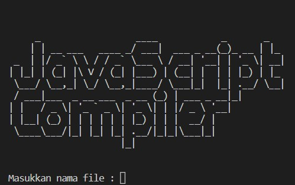

# Tugas Besar IF 2124 Teori Bahasa Formal
> Aplikasi Context Free Grammar (CFG) dan Finite Automata (FA) untuk membuat sebuah parser bahasa pemrograman (python)

## Kelompok Copinger
 Nama | NIM |
| ----------- | ----------- |
| Angger Ilham A | 13521001 |
| Kelvin Rayhan Alkarim | 13521005 |
| Kartini Copa | 13521026 |

## Table of Contents
* [Deskripsi Umum](#deskripsi-umum)
* [Tampilan](#tampilan)
* [Cara menjalankan program](#cara-menjalankan-program)

## Tampilan

## Deskripsi Umum
Dalam proses pembuatan program dari sebuah bahasa menjadi instruksi yang dapat dieksekusi oleh mesin, terdapat pemeriksaan sintaks bahasa atau parsing yang dibuat oleh programmer untuk memastikan program dapat dieksekusi tanpa menghasilkan error. Parsing ini bertujuan untuk memastikan instruksi yang dibuat oleh programmer mengikuti aturan yang sudah ditentukan oleh bahasa tersebut. Baik bahasa berjenis interpreter maupun compiler, keduanya pasti melakukan pemeriksaan sintaks. Perbedaannya terletak pada apa yang dilakukan setelah proses pemeriksaan (kompilasi/compile) tersebut selesai dilakukan.

## Cara menjalankan program
1. Clone repository ini
3. Buka cmd pada windows atau terminal pada Linux
4. Ubah direktori ke lokasi repository yang sudah di-clone
5. Ketik 'cd src' pada cmd atau windows yang direktorinya telah diubah
6. Ketik py 'main.py- pada cmd atau windows
6. Program sudah dapat dijalankan dengan input nama file JavaScript untuk melakukan kompilasi
